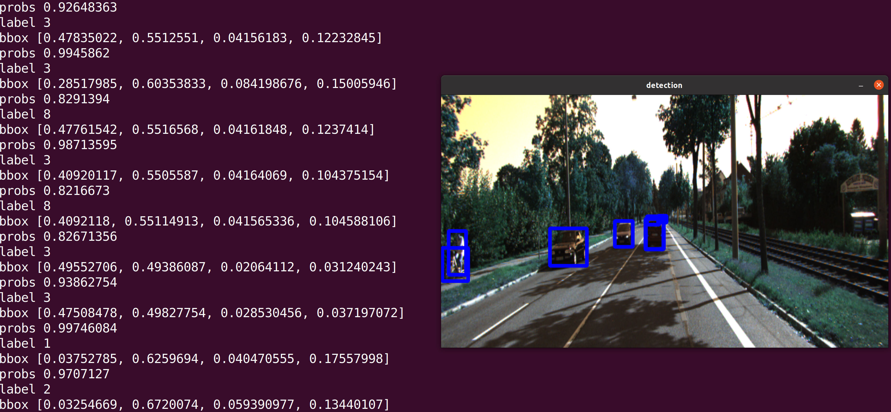

## about

- this repo test the object detection and segmentation models with tvm in ROS2 

## how to run 

- the object detection model is [DETR](https://ai.facebook.com/blog/end-to-end-object-detection-with-transformers/) 
   - I tried many models from mxnet, tensorflow, and pytorch, DETR from pytorch is the only one what works correctly in tvm rust
   - the script to generate the tvm graph is in `scripts/test_detection_pytorch.py`
- the image segmentation model is [unet](https://github.com/gasparian/multiclass-semantic-segmentation)
   - the script to generate the tvm graph is in `scripts/test_seg.py`

1. generate the models for tvm using the python scripts are in the `scripts` folder 
2. `cargo run`
3. run the [ROS2 kitti dataset publisher](https://github.com/shanmo/ros2_kitti) 

## performance 

- for cpu version `tigerlake`
   - object detection takes about `478.95ms ns` per image, which is `2.06 Hz` 
   - segmentation takes about `356.32ms ns` per image, which is `2.81 Hz` 

## demo 

- object detection

- image segmentation

## reference 

- [Optimizing PyTorch models for fast CPU inference using Apache TVM](https://spell.ml/blog/optimizing-pytorch-models-using-tvm-YI7pvREAACMAwYYz)
